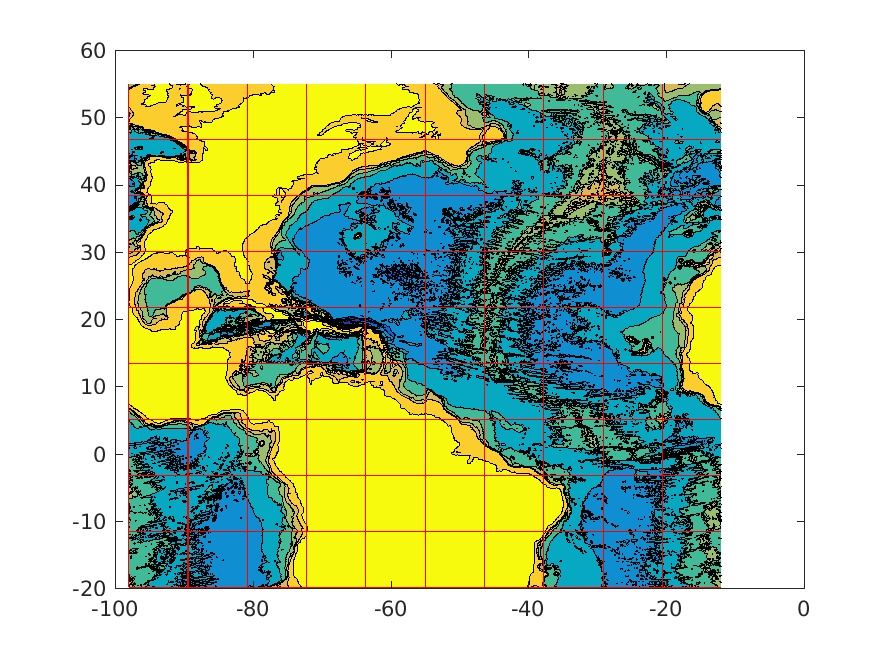

# Chaocean

The goal of this project is to diagnose the origin of the low-frequency variability in the North Atlantic.

## Initial condition, open boundaries and atmospheric forcing

All the scripts needed to build the script directory. The main script is mygendata.m. To generate new initial condition you need to set

- the output directory
```
dir_o = '/tank/groups/climode/chaocean/init_cond97_12/';
```

- Then tere are a couple of flags; if you start from scratch, it should be
```
build_init = 1; % 1: generate initial conditions, 0: no
build_obcs = 1; % 1: generate open boundaries files, 0: no

build_atmosphere = 1; % 1: generate atmospheric forcing files, 0: no

flag_cut = 1;  % 1: put eastern atlantic in south america, 0: no
flag_interp = 0; % 1: matlab interpolation (slower), 0: mygriddata
flag_plot = 0; % 1: plot a couple of diags, 0: no
```

- In the NEW GRID section, adjust the grid size. For example, to set the resolution to 1/12, do
```
dla = 1/12.;
dlo = 1/12;
```

- Choose the vertical grid: you can comment/uncomment the dz_fi line you like or create a new one.

## Configuration files for MITgcm

All these files are in the MITgcm directory. The 2 sub-directories are input and code (usual MITgcm configurations files). Each time you change the resolution, you need to make sure the parameters in 'data' are still right. When the grid changes, you also need to update 'data.obcs'.

The tiles are defined in 'SIZE.h'. Here is an exemple of a tiling configuration
(this plot was produced with 'mygendata.m' with   'nxp = 10;' and  'nyp = 9;')


